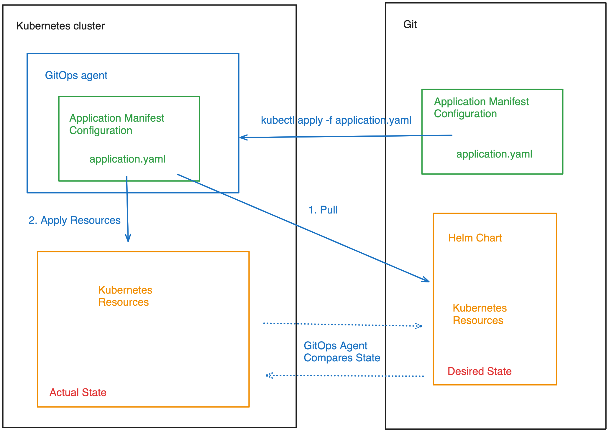
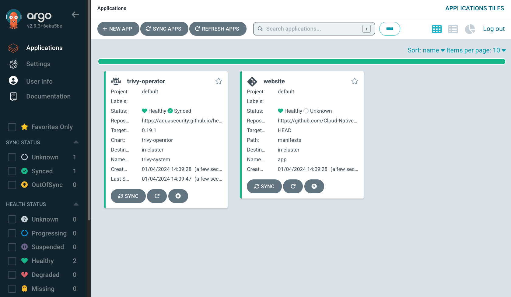

# GitOps — the magic key to cloud native security

This repository showcases how GitOps deployment can be scanned for security issues.

Including:
The Helm Chart to be deployed
The custom ArgoCD manifest

Relevant documentation:
* ArgoCD https://argo-cd.readthedocs.io/en/stable/getting_started/
* Trivy https://github.com/aquasecurity/trivy
* Helm https://github.com/helm 

This repository has been used in the following presentation at ArgoCon EU 2023:
[GitOps - The Magic Key to Cloud Native Security - Anais Urlichs, Aqua Security](https://youtu.be/nGcvPAQdpVg)



## Installing ArgoCD inside the Kuberneres cluster

Install ArgoCD inside of the cluster

```
kubectl create namespace argocd
kubectl apply -n argocd -f https://raw.githubusercontent.com/argoproj/argo-cd/stable/manifests/install.yaml
```

Access the password for the UI
```
kubectl -n argocd get secret argocd-initial-admin-secret -o jsonpath="{.data.password}" | base64 -d; echo
```

Port-forwards the ArgoCD service:
```
kubectl port-forward svc/argocd-server -n argocd 8000:443
```

Log into ArgoCD
```
argocd login localhost:8000
```

## Scanning the Helm manifest and other deployment resources

Scan the container image used:
```
trivy config Dockerfile
```

Scan the container image used:
```
trivy image anaisurlichs/cns-website:0.1.1
```

Scan the Helm Chart to be deployed:
```
trivy config ./manifests --severity MEDIUM
```

### Run the container image

The container image can be run with the following command:

```
docker run -p 8080:80 anaisurlichs/cns-website:0.1.1
```

## Scanning the custom ArgoCD Application Deployment

```
trivy config --policy ./policies --namespaces user ./argocd/application-deployment.yml
```

## Installing the application through ArgoCD

```
kubectl apply -f argocd
```



